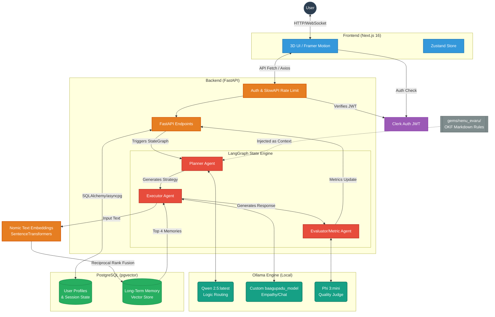

# Baagupadu - Technical Architecture & Tech Stack (MVP v1.0)

This architectural breakdown was generated by strictly scanning the current project files (`frontend/package.json`, `backend/requirements.txt`, `docker-compose.yml`, and LangGraph state files) to ensure 100% precision.

---

## 1. Technical Stack Breakdown

### Frontend (Client-Side)
- **Framework:** Next.js 16.2.9 (App Router)
- **Core Library:** React 19
- **Styling:** TailwindCSS 4
- **State Management:** Zustand
- **Authentication:** Clerk (`@clerk/nextjs`)
- **3D & Animations:** Three.js, React Three Fiber (R3F), Framer Motion
- **Data Visualization:** Recharts, XYFlow (React Flow)
- **Data Fetching:** Axios, Tanstack React Query

### Backend (API & Orchestration)
- **Framework:** FastAPI (Asynchronous Python API)
- **Server Engine:** Uvicorn
- **AI Framework:** LangChain & LangGraph (Stateful Multi-Agent Orchestration)
- **Authentication/Security:** PyJWT (Clerk Token Verification), SlowAPI (Rate Limiting)
- **Database ORM:** SQLAlchemy (Async)

### Database & RAG Infrastructure
- **Core Database:** PostgreSQL 15 (Dockerized)
- **Driver:** `asyncpg` (Asynchronous connection pooling)
- **Vector Search:** `pgvector` extension (for Long-Term Memory & RAG)
- **Embeddings:** Sentence Transformers (`nomic-ai/nomic-embed-text-v1.5`)
- **Memory Retrieval:** Reciprocal Rank Fusion (RRF) - combining Keyword Search & Vector Cosine Distance.

### Local AI & Infrastructure (Docker Compose)
- **LLM Hosting:** Ollama (Offline / Local GPU/CPU inference)
- **The Chat Engine:** Fine-Tuned Llama-3-8B (Stored locally as `.gguf`)
- **The Reasoning Engine:** `qwen2.5:latest`
- **The Evaluator Engine:** `phi3:mini` (Calculates ROUGE-L / Distinct-2 metrics)
- **Tunneling:** Cloudflared (Secure exposing of local frontend)
- **Automation:** n8n (Webhooks/Workflows)

---

## 2. Technical Architecture Diagram

### Flow Explanation
1. **Client Request:** The user interacts with the React Three Fiber 3D UI. The request is authenticated via Clerk and sent to the FastAPI backend.
2. **Orchestration:** FastAPI hands the request to **LangGraph**. 
3. **Planning:** The **Planner Agent** (using `qwen2.5`) pulls psychological rules from the Markdown Knowledge Base (`gems/nenu_evaru/`) and formulates a strategy.
4. **Context Retrieval:** The **Executor Agent** embeds the user's input using `nomic-embed-text` and performs a Reciprocal Rank Fusion (RRF) search against `pgvector` to pull exactly 4 hyper-relevant past memories.
5. **Execution:** The **Executor Agent** (using the fine-tuned `baagupadu_model`) merges the plan and the memories to generate a highly empathetic, Gen-Z response.
6. **Evaluation:** The **Evaluator Agent** (using `phi3:mini`) evaluates the response in the background for Distinct-2 and ROUGE-L metrics, saving quality signals back to the database.
